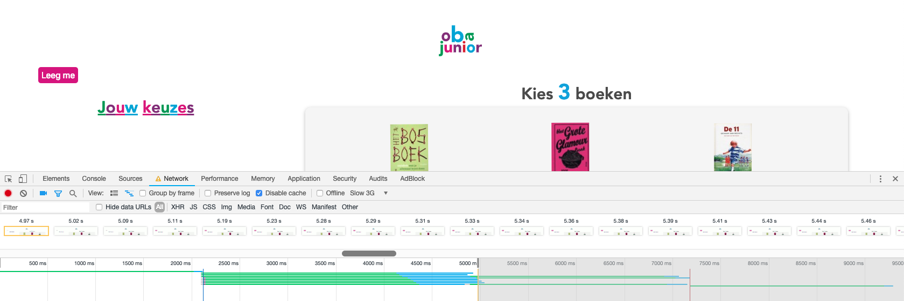

## Performance Matters Oba 

In the first week I turned my OBA site into a server side rendering app, it was previously only client-side renderen and would cease to function if javascript was off. To achieve this I used NodeJS.
The data i use to render my page is fetched from a json file made by [mennau]([https://github.com/Mennauu).

### Before performance enhancements on slow 3G
When I tested my OBA site on slow 3G the app took 31 seconds till it was fully rendered.  

file sizes with no compression  

First paint on client side rendering is after 5.1 seconds

### After minification on slow 3G
It takes the app 9.2 seconds till it's fully rendered  

file sizes for the biggest files (biggest files at the top) with css compression  

first paint in the minified css server side version is after 2.13 seconds.

### After caching on slow 3G
It takes the app 8.5 seconds till it's fully rendered    

file sizes with caching  

first paint in the server side version with cahce and minified css stays the same at 2.13 seconds.

### Even quicker/sooner usable page with lazy loading  
i wrote a simple function that lazyloads all images (load images when they enter the viewport) making the site extremely fast to load.  
On top of this I tried to minify the script with gulp to make it even lighter to load. But that didn't work, the javascript file appeared to be so small that once compressed it took the browser longer to unpack and serve it than it did without any minification.  
  
Images are only loaded once they enter the viewport, the lazy loader saves a lot of runtime because it only loads images that are required.

### Service worker
The final performance updgrade i implemented was a service worker. This service worker makes it possible to cache certain pages and elements from the page that you can re-use. It makes it possible to pre-load certain designated pages and assets (such as the css, javascript and the offline and home pages) even when you have no data connection. It also caches any requests the client makes, so any pages the client views will be saved in cache storage. The first way is precaching and the second is called runtime caching.  

<!-- Add a link to your live demo in Github Pages 🌐-->
